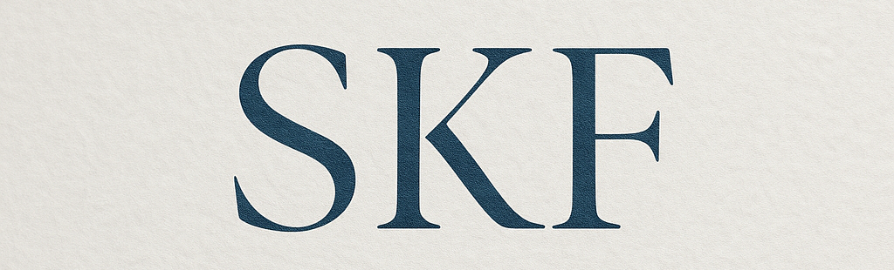

# WD-Finals


<p>
  
</p>

---

## 📘 Overview

This is a **multi-page personal portfolio** project for **WD-Finals**, developed to highlight my background as a **BSIT-BA student at FEU Tech**.  
It includes sections such as:

- About Me  
- Projects  
- Contact  
- Feedback  

All pages are responsive, visually elegant, and consistent in structure.

---

## 🧩 Key Components

✅ Chat-style landing page  
✅ About Me with education section  
✅ Project gallery with images  
✅ Contact and feedback form  
✅ Page-specific assets  
✅ Google Fonts, responsive design, and transition effects  

---

## 🎯 Guiding Questions

**📌 What is this project about?**  
A responsive and well-designed personal website that reflects my identity, work, and creativity.

**📌 What is its purpose?**  
To showcase both my academic and creative growth throughout my program.

**📌 What are its key components?**  
Clean multi-page layout, profile photo, animated chat interface, education timeline, and links to projects.

---

## 🛠️ Technology


---

## 🗂️ File Structure

```plaintext

WD-FINALS/
│
├── .github/
│   └── workflows/
│       └── static.yml
│
├── assets/
│   ├── css/
│   │   └── style.css
│   └── imgs/
│       ├── download (5).jpeg
│       └── logo.png
│
├── pages/
│   ├── page1/                
│   │   ├── index.html
│   │   └── assets/
│   │       ├── css/
│   │       │   └── style.css
│   │       └── imgs/
│   │           ├── bg3.jpeg
│   │           └── test.jpeg
│   │
│   ├── page2/                
│   │   ├── index.html
│   │   └── assets/
│   │       ├── css/
│   │       │   └── style.css
│   │       └── imgs/
│   │           ├── bg.jpeg
│   │           ├── sw1.JPG
│   │           └── sw2.jpeg
│   │
│   ├── page3/                
│   │   ├── index.html
│   │   └── assets/
│   │       ├── css/
│   │       │   └── style.css
│   │       └── imgs/
│   │           └── bg2.jpeg
│   │
│   └── page4/                
│       ├── index.html
│       └── assets/
│           ├── css/
│           │   └── style.css
│           └── imgs/
│               └── bg4.jpeg
│
├── index.html                
└── readme.md


---

## Resources

| Title         | Purpose                         | Link                        |
| ------------- | ------------------------------- | --------------------------- |
| Pinterest     | Source of aesthetic background  |(https://www.pinterest.com)  |
|               | images used for page designs    |                             |
|               |                                 |                             |
| Google        | Additional source for           |(https://www.google.com/)    | 
|               | high-quality and calming        |                             |
|               | background visuals              |                             |
|               |                                 |                             |
| Facebook      | Personal source for profile     |(https://www.facebook.com/)  |
|               | photo to personalize the        |                             |
|               | "About Me" section              |                             |

